<div align="center">

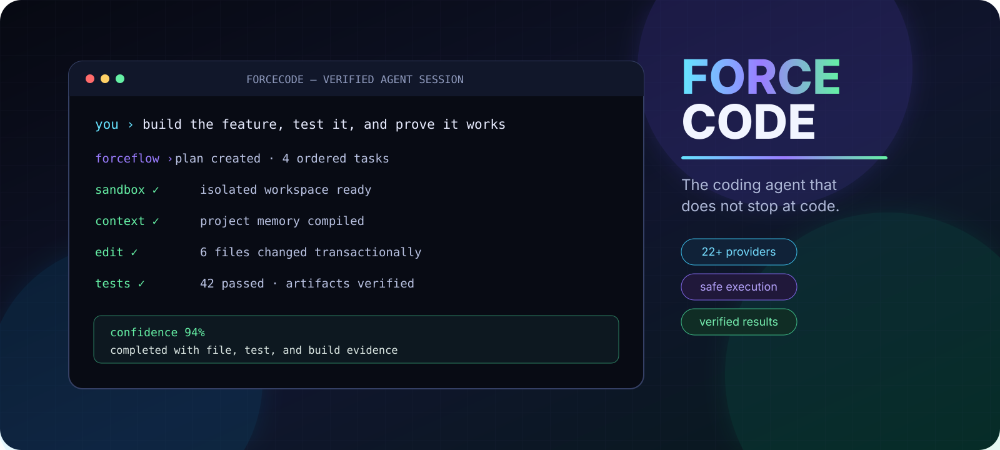

<br />

# ForceCode

### Bring your own model. Give it real tools. Demand proof.

A local-first terminal coding agent that can understand a project, edit real files, run commands, build, test, repair failures, and prove what it completed.

**22+ providers · local models · custom APIs · isolated execution · verified results**

[](CHANGELOG.md)
[](https://www.python.org/)
[](#quick-start)
[](LICENSE)

[Quick Start](#quick-start) · [Workflow](#from-request-to-verified-result) · [Providers](#use-the-model-that-fits-the-job) · [Safety](#safety-is-part-of-the-architecture) · [Commands](#essential-commands)

</div>

> [!IMPORTANT]
> ForceCode is an independent open-source project. It is not affiliated with OpenAI, Anthropic, Google, or any supported provider.

---

## Why ForceCode exists

Most coding assistants stop after producing plausible code. ForceCode is built around a stricter definition of completion.

<table>
<tr>
<td width="33%" valign="top">

### Understand

- Incremental project indexing
- Project-aware memory
- Token-budgeted context
- Architecture and impact analysis

</td>
<td width="33%" valign="top">

### Execute

- File creation and exact edits
- Commands and interactive programs
- Builds, tests, packaging
- Automatic repair cycles

</td>
<td width="33%" valign="top">

### Prove

- Test evidence
- Build receipts
- Artifact checks
- Confidence reports

</td>
</tr>
</table>

| Ordinary assistant behavior | ForceCode behavior |
| --- | --- |
| Produces an answer | Changes the project |
| Assumes the change works | Runs focused checks |
| Uses one provider | Supports 22+ providers and custom APIs |
| Forgets decisions | Retrieves relevant project memory |
| Runs tools directly | Works inside an isolated project copy |
| Stops at failure | Debugs, repairs, retries, and reports evidence |

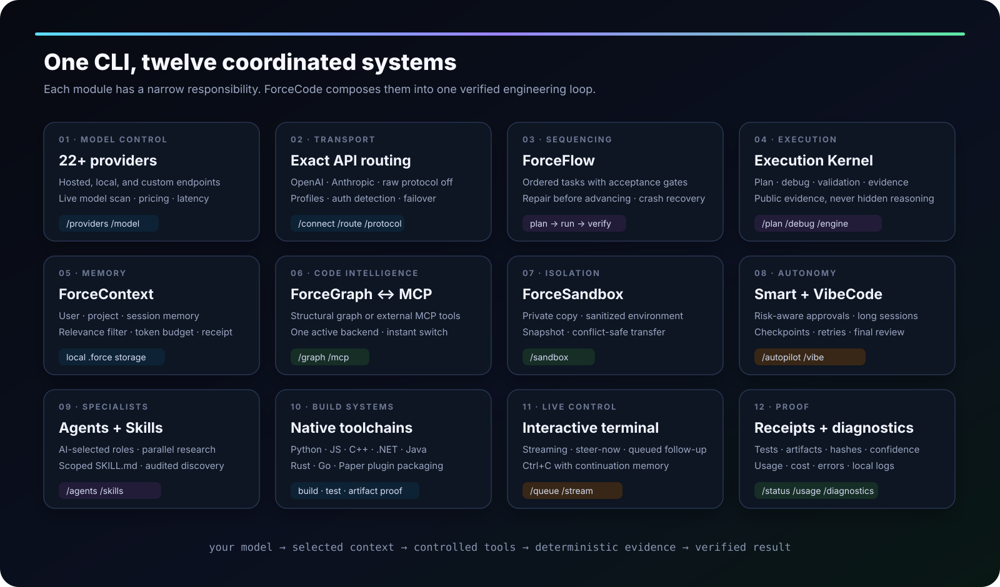

---

## From request to verified result

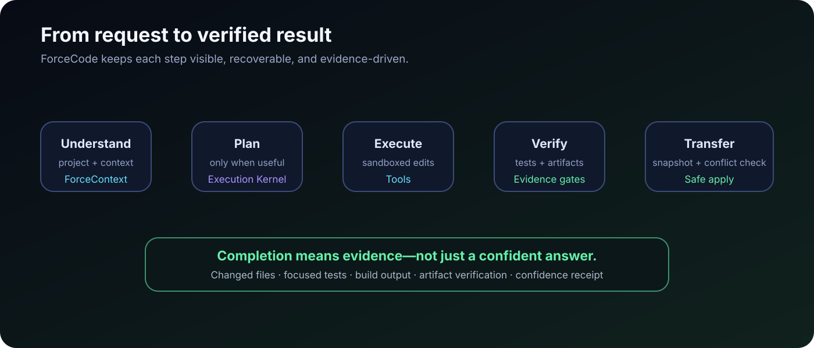

```text
you › add authentication, build the settings UI, test the complete flow,
      and do not report success without evidence

forceflow › 3 ordered tasks created
sandbox  › isolated workspace ready
edit     › 8 files changed
verify   › 47 tests passed · build artifact found
transfer › snapshot created · conflict check passed
forge    › completed with evidence
```

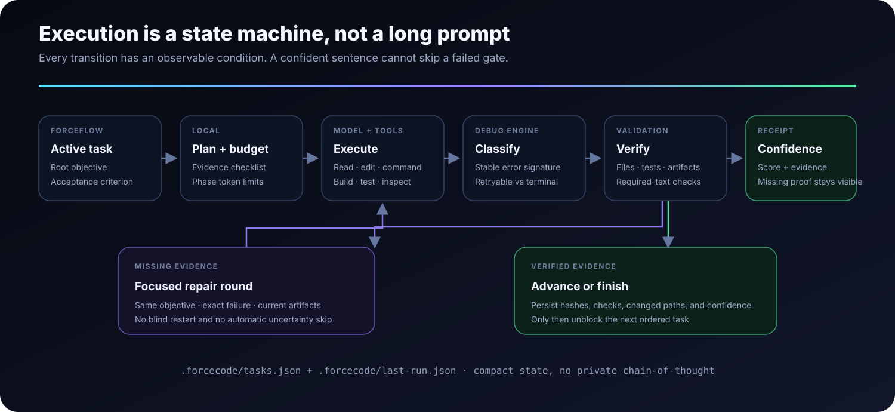

### ForceFlow + Execution Kernel

Turns explicit multi-step work into ordered tasks. Later tasks remain blocked until earlier tasks satisfy their acceptance criteria.

Tracks the public plan, tool failures, debugging state, missing verification, and confidence. It stores evidence—not private chain-of-thought.

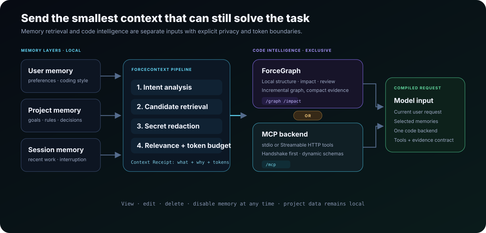

### ForceContext + code intelligence

Retrieves only the project facts, preferences, and session notes relevant to the current request under a strict token budget.

Adds optional local structural intelligence for architecture understanding, blast-radius analysis, review, and test-gap discovery.

Connect project MCP servers over stdio or Streamable HTTP and expose their tools directly to the active model. ForceCode can safely discover secret-free entries from `.mcp.json`, and the AI receives MCP management controls only after an explicit user request. A verified MCP connection automatically pauses ForceGraph to prevent duplicate context; type `/mcp` or say `ForceGraph'a geri geç` to switch back instantly.

```text
/mcp discover
/mcp add local-tools stdio my-mcp-server --repo .
/mcp add remote-tools http https://example.com/mcp
/mcp use local-tools
/mcp tools
/mcp
```

### VibeCode

Runs broad product goals as checkpointed, resumable, evidence-driven long sessions with repair cycles and an independent final review.

---

## Use the model that fits the job

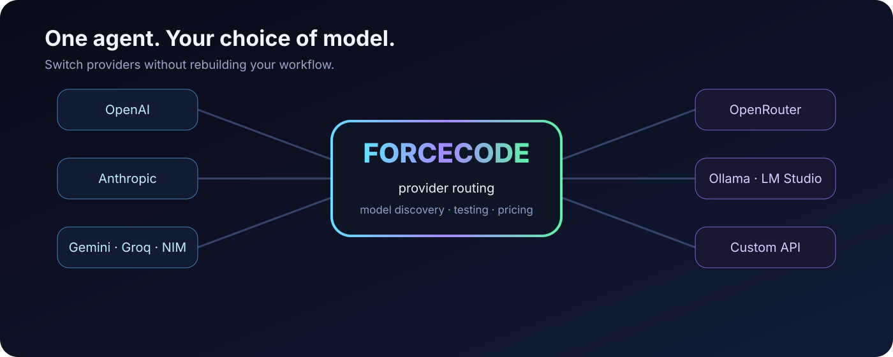

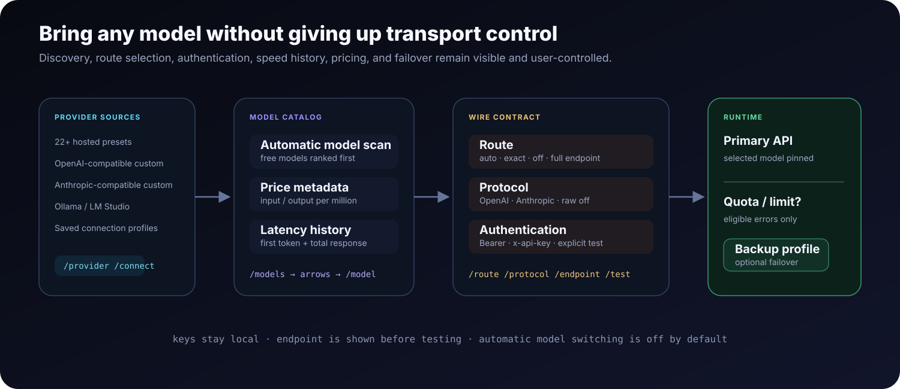

ForceCode includes presets for:

<div align="center">

**Anthropic · OpenAI · OpenRouter · Gemini · Groq · Mistral · DeepSeek · xAI · Together · Fireworks · Perplexity · Cerebras · SambaNova · NVIDIA NIM · Cohere · Kimchi · GitHub Models · Hugging Face · SiliconFlow · DashScope · Ollama · LM Studio**

</div>

Custom OpenAI-compatible and Anthropic-compatible APIs are supported too.

```text
/provider custom
/connect https://your-service.example
/protocol auto
/key
/models
/test
```

Built-in provider tooling includes model discovery, connection testing, response-latency history, token accounting, configurable pricing, saved profiles, and optional backup-provider failover.

For gateways where protocol inference rewrites or rejects a valid custom URL, disable enforcement and send to the selected route exactly as configured:

```text
/route https://gateway.example/custom/inference
/protocol off openai
/endpoint
/test
```

`/protocol off` keeps the current payload format; append `openai` or `anthropic` to choose it explicitly. In this mode ForgeCode does not infer a protocol from the model or route, append `/v1/messages` or `/chat/completions`, or replace the route after a 404. Authentication remains independently configurable through `custom_auth_mode`.

> Use only endpoints you are authorized to access. ForceCode does not bypass provider restrictions or access controls.

---

## Safety is part of the architecture

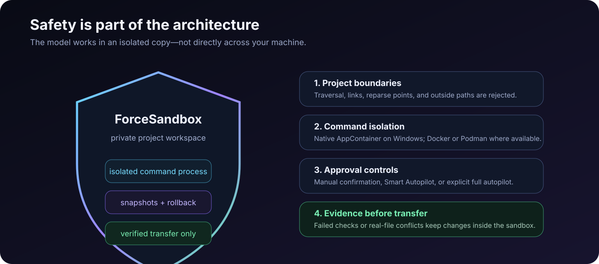

ForceSandbox is enabled by default.

On Windows, generic commands run under a per-project AppContainer identity. The model works inside a private project copy with its own home and temporary directories, sanitized environment variables, process limits, and no inherited provider key.

Verified changes return to the real project only after:

1. A project snapshot is created.
2. Required checks pass.
3. The real files are checked for concurrent changes.
4. Paths and transfer targets pass deterministic safety validation.

Failed verification or a conflict leaves the work inside the sandbox. When no supported isolation engine is available, command execution fails closed rather than silently running without protection.

Read [SECURITY.md](SECURITY.md) for the vulnerability-reporting and supported-version policy.

---

## Quick start

### Requirements

- Windows 10 or Windows 11
- Python 3.10 or later
- A hosted provider key, or local Ollama / LM Studio

### Portable launch

```powershell
git clone https://github.com/samansarmasik-alt/forcecode.git
cd forcecode
.\forgecode.bat .
```

On first launch, choose a language and provider, then run:

```text
/key
/test
```

### Install the global `Force` command

```powershell
.\install-force.ps1
```

Open a new terminal from any project:

```powershell
cd C:\path\to\your-project
Force
```

One-shot mode:

```powershell
Force -p "Review the current changes, fix the root cause, and run the relevant tests"
```

Headless managed team mode uses one main manager and at most three specialist AIs (four AIs total). Workers share a persistent coordination board, finish at a synchronization barrier, and the manager integrates and verifies their reports:

```powershell
Force --team "Inspect the API failures, fix the root cause, and run the relevant tests"
Force --team-status
```

The same `.forgecode/team-state.json` board is visible from another terminal with `--team-status`. In interactive mode use `/team <task>` and `/team status`.

For a persistent visible fleet, terminal 1 is always the manager/design director and up to three worker terminals can be added or removed while ForceCode is running:

```text
/terminal add design
/terminal add backend
/terminal task all "Inspect the current implementation and report focused findings"
/terminal configure 2 high 2400
/terminal status
/terminal remove 2
```

You can also ask naturally: `Bu iş için gerekli terminal ekibini kur, görevleri dağıt ve sonuçları birleştir.` Terminal 1 then uses one orchestration call to create or reuse one to three workers, select each worker's temporary `off|low|medium|high` thinking level and output budget, queue independent work, and synthesize their shared reports. Fleet mutation is authorized only when the user explicitly asks for a team/terminal action.

Workers are read-only, see the latest shared reports before each assignment, and publish their result back to terminal 1. The current provider and model are inherited and never changed by the manager. `model_lock` defaults to `true`, so automatic API recovery can repair an endpoint but cannot switch models; only explicit user commands such as `/model`, `/provider`, and `/agentconfig` choose another model. Use `/browser open <url>` and `/browser read` for the dedicated local Chrome profile. Chrome control never reads cookies, passwords, or browser storage.

The streaming music queue uses the official YouTube iframe player and never downloads media:

```text
/music search synthwave coding mix
/music add https://youtu.be/VIDEO_ID "Focus track"
/music play
/music next
/music on
```

`/music on` enables startup playback when a queue exists. ForceCode does not block or bypass YouTube ads; an ad-free session requires the user's own YouTube Premium account.

Existing subscriptions can be bridged through an already signed-in official vendor CLI with `/subscriptions` and `/subscriptions use <claude|codex|cline|gemini>`. For Cline, run `/subscriptions setup cline` once to launch the official `cline auth` wizard, then `/subscriptions use cline` and `/test`. Cline runs in safe plan mode with `--json` output; ForgeCode extracts its visible `say.text` responses instead of exposing JSON events. ForceCode does not copy browser cookies, OAuth tokens, or subscription credentials. These adapters are deliberately advisory/read-only.

Request history is also kept under a rolling input budget (`input_budget_tokens`, default 24,000; `efficiency=max` caps it at 12,000). Old tool rounds are compacted before the next billed API request, and empty-response retries use a reduced transcript.

---

## Describe work normally

No special command is needed for ordinary engineering tasks.

<table>
<tr>
<td width="50%" valign="top">

### Debug a project

```text
inspect this repository, find why the API tests fail,
fix the root cause, run focused tests, and explain
every changed file
```

</td>
<td width="50%" valign="top">

### Build a product

```text
create a Paper plugin with configurable kits,
build the JAR, and do not report success unless
the artifact exists
```

</td>
</tr>
<tr>
<td width="50%" valign="top">

### Improve a website

```text
redesign this site, keep its framework, make it
responsive, test the main flows, and repair anything
the quality gate rejects
```

</td>
<td width="50%" valign="top">

### Review a release

```text
audit this project for release readiness, inspect
tests and packaging, fix critical issues, and leave
a verification report
```

</td>
</tr>
</table>

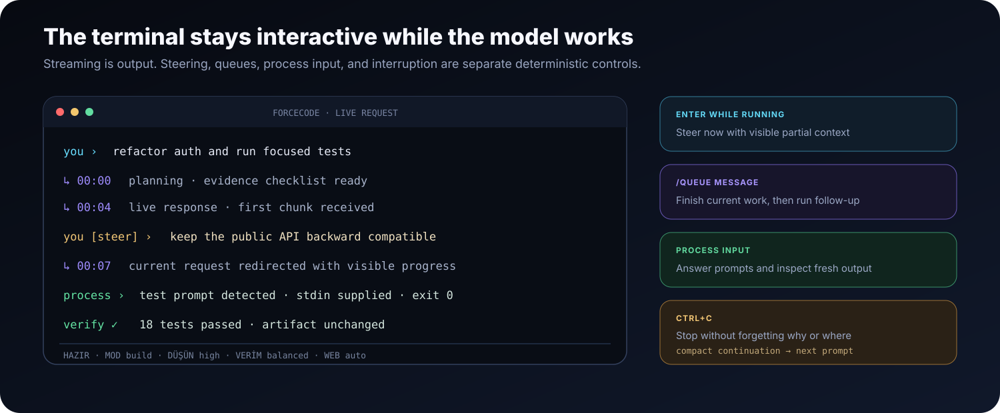

While a request is active:

- Send a normal message to steer the work.
- Use `/queue <message>` to add follow-up work.
- Press `Ctrl+C` to stop while preserving a compact continuation summary.

---

## Autonomy with controls

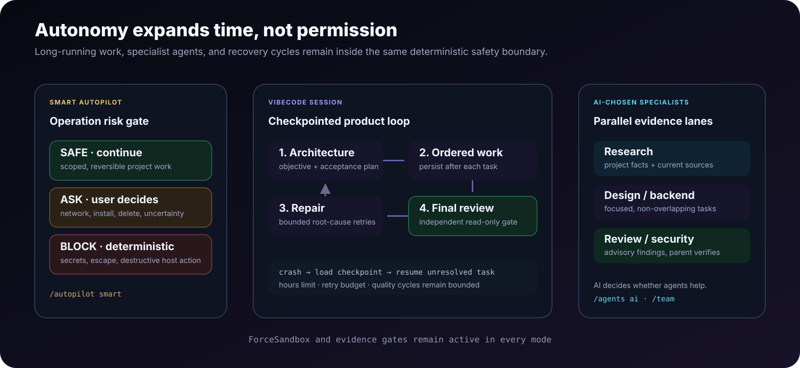

### Smart Autopilot

```text
/autopilot smart
```

Approves clearly safe project work while deterministic protections continue blocking known destructive system operations.

Full autopilot is available for disposable or version-controlled workspaces:

```text
/autopilot on
```

### VibeCode

```text
/vibe hours 10
/vibe Build a polished release-ready application, test important flows, repair failures, and leave a final report
```

VibeCode creates an architecture and acceptance plan, executes one task at a time, compacts expensive context, retries temporary provider failures, stores crash-safe checkpoints, and performs an independent read-only final review.

Resume an interrupted session with:

```text
/vibe resume
```

VibeCode never disables ForceSandbox or weakens the safety boundary.

---

## Built-in project toolchain

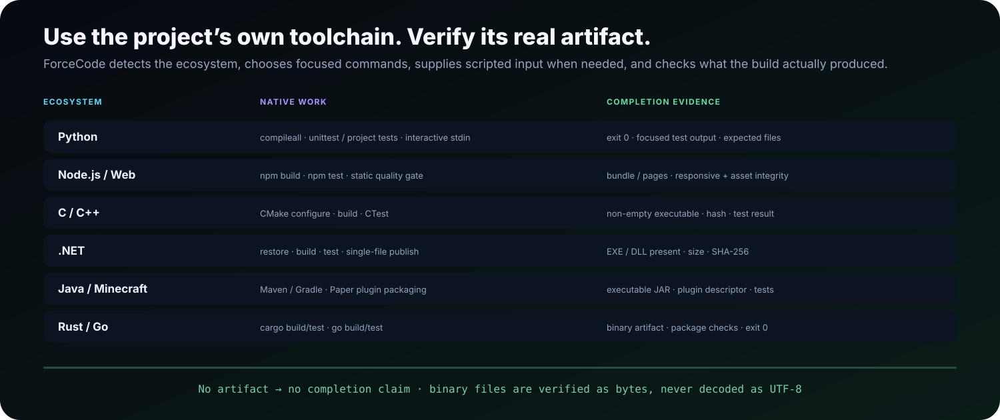

| Ecosystem | Supported work |
| --- | --- |
| Python | Syntax checks, tests, project execution |
| Node.js | npm-compatible builds and tests |
| C / C++ | CMake, CTest, executable verification |
| .NET | Build, test, single-file publishing |
| Java | Maven, Gradle, executable JARs |
| Minecraft | Paper plugin scaffolding and JAR verification |
| Rust | Cargo build and test workflows |
| Go | Builds, tests, packaged binaries |

For binary-producing tasks, ForceCode does not mark work complete unless the expected non-empty artifact exists.

---

## Agent Skills

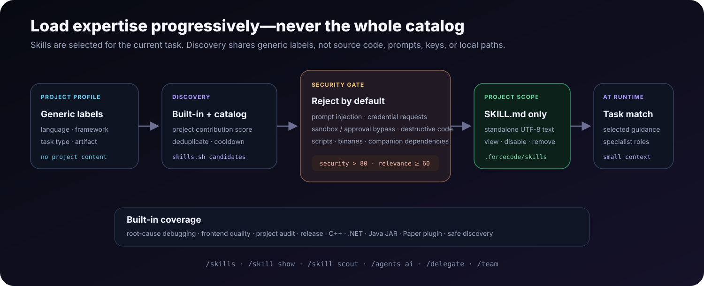

ForceCode supports the portable `SKILL.md` format and adds only the selected skills to the current model context.

Built-in skills cover:

- Root-cause debugging
- Frontend quality
- Project audits
- Release readiness
- Native C++
- .NET applications
- Java JARs
- Minecraft Paper plugins
- Safe skill discovery

```text
/skills
/skill show frontend-quality
/skill install owner/repo project
/skill update frontend
```

Skill Scout can search the public skills.sh catalog using generic project labels. Source code, prompts, paths, keys, and user data are not sent. Automatically accepted skills must pass deterministic security checks and score thresholds. Scripts and executable companion files are never imported automatically.

---

## Essential commands

| Area | Commands |
| --- | --- |
| Provider setup | `/providers`, `/provider`, `/subscriptions`, `/key`, `/models`, `/model`, `/test` |
| Custom APIs | `/connect`, `/protocol`, `/route`, `/endpoint`, `/profiles` |
| Safety | `/autopilot smart\|on\|off`, `/sandbox`, `/doctor`, `/diagnostics` |
| Execution | `/plan`, `/debug`, `/confidence`, `/engine` |
| Continuity | `/goal`, `/resume`, `/sessions`, `/memory`, `/remember`, `/init` |
| ForceContext | `/force-context-init`, `/force-context-scan`, `/force-context-update` |
| Code intelligence | `/graph`, `/impact`, `/review`, `/mcp` |
| Skills and agents | `/skills`, `/skill`, `/agents`, `/delegate`, `/team`, `/terminal` |
| Browser and media | `/browser`, `/music` |
| Long work | `/vibe`, `/watchdog`, `/retry`, `/queue` |
| Visibility | `/status`, `/usage`, `/history`, `/context`, `/activity`, `/dashboard` |
| Interface | `/language en`, `/language tr`, `/help`, `/clear`, `/exit` |

Run `/help` inside ForceCode for the full command reference.

---

## Local data and privacy

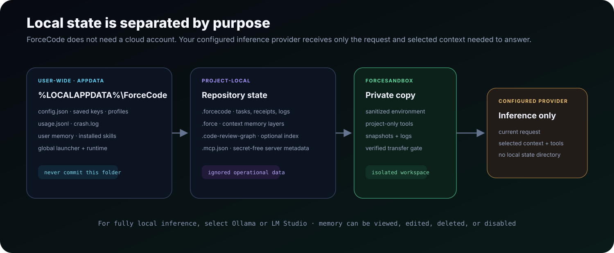

| Data | Default location |
| --- | --- |
| Configuration and saved keys | `%LOCALAPPDATA%\ForgeCode\config.json` |
| Usage history | `%LOCALAPPDATA%\ForgeCode\usage.jsonl` |
| Crash log | `%LOCALAPPDATA%\ForgeCode\crash.log` |
| Installed runtime | `%LOCALAPPDATA%\ForgeCode\app` |
| Global launcher | `%LOCALAPPDATA%\ForgeCode\bin\Force.cmd` |
| User memory | `%LOCALAPPDATA%\ForgeCode\memory\user.json` |
| Sandboxes and snapshots | `%LOCALAPPDATA%\ForgeCode\sandboxes\<project-id>` |
| User skills | `%LOCALAPPDATA%\ForgeCode\skills` |

Project operational state stays in `.forgecode`, ForceContext data stays in `.force`, and optional ForceGraph indexes stay in `.code-review-graph`. These locations should not be committed.

The provider you configure receives the prompts and selected context required to answer the request. Use Ollama or LM Studio when model inference must remain local.

---

## Development

ForceCode intentionally has no third-party runtime package dependencies.

```powershell
python -m unittest discover -s tests -v
python -m py_compile forgecode.py
python forgecode.py --version
```

```text
.
├── .github/                 Issue and pull-request templates
├── docs/                    Technical documentation and artwork
├── tests/                   Unit and integration-style tests
├── forgecode.py             Application and CLI entry point
├── forgecode.bat            Portable Windows launcher
├── install-force.ps1        Global command installer
├── uninstall-force.ps1      Global command uninstaller
├── config.example.json      Sanitized configuration reference
├── CONTRIBUTING.md          Contribution guide
├── SECURITY.md              Security policy
├── CHANGELOG.md             Release notes
└── LICENSE                  MIT License
```

Before contributing, read [CONTRIBUTING.md](CONTRIBUTING.md), add tests for behavior changes, and never commit provider credentials.

---

## Project status

Current development version: **v7.12.0**

See [CHANGELOG.md](CHANGELOG.md) for release history and technical details.

---

## License

ForceCode is released under the [MIT License](LICENSE).

<div align="center">

### Code is easy to generate. Reliable engineering is the real feature.

**Star the repository if ForceCode is useful to you.**

</div>
