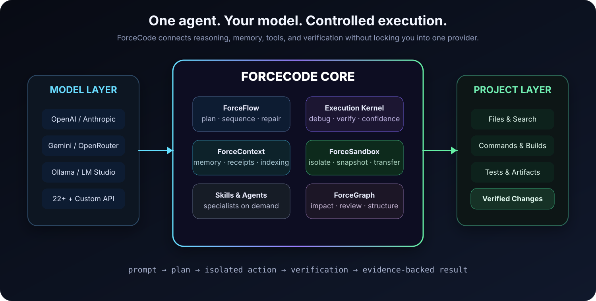

<div align="center">


<br />

# ForceCode

### Bring your own model. Give it real tools. Demand proof.

ForceCode is a local-first terminal coding agent that can inspect a project, plan work, edit files, run commands, test the result, recover from failures, and show the evidence behind its answer.

It works with **22+ providers**, local models, and custom APIs—without locking your workflow to one company or one model.

[](CHANGELOG.md)
[](https://www.python.org/)
[](#requirements)
[](LICENSE)

[Quick Start](#quick-start) · [Why ForceCode](#why-forcecode) · [How It Works](#how-it-works) · [Commands](#essential-commands) · [Security](SECURITY.md)

</div>

> [!IMPORTANT]
> ForceCode is an independent open-source project. It is not affiliated with, endorsed by, or distributed by OpenAI, Anthropic, Google, or any supported provider.

---

## Why ForceCode

Most coding assistants can produce code. ForceCode is designed to complete the rest of the job too.

| Typical coding assistant | ForceCode |
| --- | --- |
| Generates a plausible answer | Edits the real project and verifies the result |
| Tied to one model or vendor | Connects to 22+ providers, local models, and custom APIs |
| Forgets project decisions | Uses project-aware memory with visible context receipts |
| Claims a task is complete | Requires file, test, build, or artifact evidence |
| Runs tools directly on your machine | Uses an isolated sandbox with snapshots and controlled transfer |
| Stops after the first failure | Debugs, repairs, retries, and reports what remains |

### The core idea

```text
You describe the result.
ForceCode studies the project.
It creates a plan only when a plan is useful.
It works inside an isolated copy.
It edits, builds, tests, and repairs.
It transfers verified changes back.
It tells you what changed—and why you should trust it.
```

---

## What it can do

<table>
<tr>
<td width="50%" valign="top">

### 🧠 Understand the project

- Incremental project indexing
- Project, session, and user memory
- Token-budgeted context retrieval
- Structural code intelligence with ForceGraph
- Architecture and impact analysis

</td>
<td width="50%" valign="top">

### 🛠️ Do real engineering work

- Read, search, create, and edit files
- Run commands and interactive programs
- Build and package native project types
- Execute tests and inspect failures
- Verify output artifacts before claiming success

</td>
</tr>
<tr>
<td width="50%" valign="top">

### 🔁 Keep going when work gets difficult

- Automatic sequential task execution
- Root-cause-guided repair cycles
- Crash-safe checkpoints and resume
- Slow API and stalled connection recovery
- Optional specialist subagents

</td>
<td width="50%" valign="top">

### 🛡️ Protect the machine

- Default-on ForceSandbox isolation
- Native Windows AppContainer support
- Per-project identities and private workspaces
- Snapshots, rollback, conflict detection
- Smart approvals and deterministic command blocking

</td>
</tr>
</table>

---

## How it works



ForceCode separates model reasoning from execution safety and verification. The selected model decides what should happen; ForceCode controls what is allowed to happen and records evidence from the tools that actually ran.

### ForceFlow
Breaks large or ordered requests into verifiable steps. A later step does not pass until the current one has the required evidence.

### Execution Kernel
Tracks the public plan, tool failures, debugging state, missing checks, and confidence. It does not expose or store private chain-of-thought.

### ForceContext
Retrieves only the project facts and preferences relevant to the current task, under a strict token budget. A receipt shows what was included.

### ForceSandbox
Runs project work in an isolated copy. Verified, conflict-free changes are transferred back after a snapshot; failed or unsafe work stays inside the sandbox.

### ForceGraph
Adds optional local structural intelligence for blast-radius analysis, test-gap discovery, architecture understanding, and review.

---

## Providers: use the model that fits the job

ForceCode includes presets for:

**Anthropic · OpenAI · OpenRouter · Gemini · Groq · Mistral · DeepSeek · xAI · Together · Fireworks · Perplexity · Cerebras · SambaNova · NVIDIA NIM · Cohere · Kimchi · GitHub Models · Hugging Face · SiliconFlow · DashScope · Ollama · LM Studio**

It also supports custom OpenAI-compatible and Anthropic-compatible endpoints.

```text
/provider custom
/connect https://your-service.example
/protocol auto
/key
/models
/test
```

Model discovery, connection tests, response latency history, token accounting, configurable pricing, saved profiles, and optional backup-provider failover are built in.

> Use only services and endpoints you are authorized to access. ForceCode does not bypass provider restrictions or access controls.

---

## Quick start

### Requirements

- Windows 10 or Windows 11
- Python 3.10 or later
- An API key for a hosted provider, or a local Ollama/LM Studio setup

### Portable launch

Clone or download the repository, open PowerShell inside it, and run:

```powershell
.\forgecode.bat .
```

On first launch:

1. Choose English or Turkish.
2. Select a provider.
3. Add the provider key with `/key`.
4. Check the connection with `/test`.
5. Start describing the work normally.

### Install the global `Force` command

```powershell
.\install-force.ps1
```

Open a new terminal in any project:

```powershell
cd C:\path\to\your-project
Force
```

One-shot usage is also available:

```powershell
Force -p "Review the current changes, fix the problem, and run the relevant tests"
```

To remove the global launcher while keeping your settings:

```powershell
.\uninstall-force.ps1
```

---

## Use natural language

No special command is required for normal project work.

```text
you › inspect this project, find why the API tests fail, fix the root cause,
      run the focused tests, and explain every changed file
```

```text
you › create a Paper plugin with configurable kits, build the JAR,
      and do not report success unless the artifact exists
```

```text
you › redesign this website, keep the current framework, make it responsive,
      test the main interactions, and repair anything the quality gate rejects
```

While a request is running, a normal message can steer the active work. `/queue <message>` adds follow-up work without interrupting it. `Ctrl+C` stops the current request while preserving a compact progress summary for continuation.

---

## Autonomy without blind trust

### Smart Autopilot

Commands and file changes require approval by default. Smart Autopilot approves clearly safe project work while a deterministic safety layer blocks known destructive system operations.

```text
/autopilot smart
```

Full autopilot exists for disposable or version-controlled workspaces:

```text
/autopilot on
```

### VibeCode

VibeCode turns a broad product goal into a checkpointed, evidence-driven long run.

```text
/vibe hours 10
/vibe Build a polished release-ready application from this project, test the important flows, and leave a report
```

It creates an architecture and acceptance plan, works one task at a time, compacts expensive context, retries temporary API failures, saves crash-safe checkpoints, and runs an independent read-only final review. The session can be resumed with `/vibe resume`.

VibeCode does not disable ForceSandbox or weaken the project safety boundary.

---

## Built-in project toolchain

ForceCode detects and works with common project systems rather than assuming every task is a website.

| Ecosystem | Detection / output |
| --- | --- |
| Python | Python projects, syntax checks, tests |
| Node.js | npm-compatible builds and tests |
| C / C++ | CMake projects, executables, CTest |
| .NET | Build, test, and single-file application publishing |
| Java | Maven and Gradle projects, executable JARs |
| Minecraft | Paper plugin scaffolding and verified JAR output |
| Rust | Cargo build and test workflows |
| Go | Build, test, and packaged binaries |

For binary-producing work, ForceCode refuses to mark the task successful unless the expected non-empty artifact is found.

---

## Agent Skills

ForceCode supports the portable `SKILL.md` format. Only the skills selected for the current request are added to model context.

Built-in skills include:

- Skill Scout
- Root-cause debugging
- Frontend quality
- Project audit
- Release readiness
- Native C++
- .NET applications
- Java JARs
- Minecraft Paper plugins

```text
/skills
/skill show frontend-quality
/skill install owner/repo project
/skill update frontend
```

Skill Scout can discover project-relevant skills from the public skills.sh catalog. It sends only generic project labels—not source code, file paths, prompts, keys, or user data. Candidates must pass both deterministic safety checks and score thresholds before automatic installation. Imported skills are limited to a UTF-8 `SKILL.md`; scripts and executable companions are never imported automatically.

---

## Essential commands

| Purpose | Commands |
| --- | --- |
| Provider setup | `/providers`, `/provider`, `/key`, `/models`, `/model`, `/test` |
| Custom APIs | `/connect`, `/protocol`, `/route`, `/endpoint`, `/profiles` |
| Language | `/language en`, `/language tr` |
| Safety | `/autopilot smart\|on\|off`, `/sandbox`, `/doctor`, `/diagnostics` |
| Planning and debugging | `/plan`, `/debug`, `/confidence`, `/engine` |
| Memory and continuity | `/goal`, `/resume`, `/sessions`, `/memory`, `/remember`, `/init` |
| ForceContext | `/force-context-init`, `/force-context-scan`, `/force-context-update` |
| ForceGraph | `/graph`, `/impact`, `/review` |
| Skills and agents | `/skills`, `/skill`, `/agents`, `/delegate`, `/team` |
| Long-running work | `/vibe`, `/watchdog`, `/retry`, `/queue` |
| Visibility | `/status`, `/usage`, `/history`, `/context`, `/activity`, `/dashboard` |
| Help | `/help`, `/clear`, `/exit` |

Run `/help` inside ForceCode for the complete command reference.

---

## Safety model

ForceSandbox is enabled by default.

On Windows, generic commands run under a unique AppContainer identity in `C:\ForceCodeSandbox`. Kernel-level ACLs block access to Desktop, Documents, other projects, stored keys, and unrelated user data. Each project receives a private workspace, home directory, temporary area, process limits, sanitized environment, and no inherited provider key.

The AI works on a private project copy. Before verified changes are transferred to the real project, ForceCode creates a snapshot and checks for conflicts. Invalid paths, traversal, links, reparse points, unsafe transfers, and known destructive operations are rejected.

When no supported command-isolation engine is available, shell commands fail closed instead of silently running without protection. File tools remain available inside the private workspace.

Read [SECURITY.md](SECURITY.md) for the supported-version and vulnerability-reporting policy.

---

## Local data and privacy

Global settings stay outside the project:

| Data | Default location |
| --- | --- |
| Configuration and saved keys | `%LOCALAPPDATA%\ForgeCode\config.json` |
| Usage history | `%LOCALAPPDATA%\ForgeCode\usage.jsonl` |
| Crash log | `%LOCALAPPDATA%\ForgeCode\crash.log` |
| Installed runtime | `%LOCALAPPDATA%\ForgeCode\app` |
| Global launcher | `%LOCALAPPDATA%\ForgeCode\bin\Force.cmd` |
| User memory | `%LOCALAPPDATA%\ForgeCode\memory\user.json` |
| Sandboxes and snapshots | `%LOCALAPPDATA%\ForgeCode\sandboxes\<project-id>` |
| User skills | `%LOCALAPPDATA%\ForgeCode\skills` |

Project operational state is stored in `.forgecode`; ForceContext state is stored in `.force`; optional ForceGraph indexes are stored in `.code-review-graph`. These locations should not be committed.

Selected prompts, project context, and tool results are sent to the provider you configure. Local memory is not the same as offline inference. Use a local Ollama or LM Studio model when the full model interaction must remain local.

---

## Reliability for slow or unstable APIs

`/watchdog off` removes the total deadline for an active main-model generation, while the stall guard can still detect a connection that produces no data and retry safely.

```text
/set stall_first_response_seconds 300
/set stall_stream_idle_seconds 600
/set stall_retry_attempts 2
```

The selected model stays pinned by default. Automatic same-provider model switching must be explicitly enabled:

```text
/set auto_model_switch true
```

---

## Development

ForceCode intentionally has no third-party runtime package dependencies.

Run the full test suite:

```powershell
python -m unittest discover -s tests -v
```

Check syntax and the CLI entry point:

```powershell
python -m py_compile forgecode.py
python forgecode.py --version
```

Repository layout:

```text
.
├── .github/                 Issue and pull-request templates
├── docs/                    Technical documentation and artwork
├── tests/                   Unit and integration-style tests
├── forgecode.py             Application and CLI entry point
├── forgecode.bat            Portable Windows launcher
├── install-force.ps1        Global command installer
├── uninstall-force.ps1      Global command uninstaller
├── config.example.json      Sanitized configuration reference
├── CONTRIBUTING.md          Contribution guide
├── SECURITY.md              Security policy
├── CHANGELOG.md             Release notes
└── LICENSE                  MIT License
```

Before opening a pull request, read [CONTRIBUTING.md](CONTRIBUTING.md), add tests for behavior changes, and never place provider credentials in fixtures, logs, or commits.

---

## Project status

Current development version: **v7.11.1**

This version includes adaptive stuck-connection recovery while preserving unlimited active generation with `/watchdog off`. Skill Scout, VibeCode checkpointed autonomy, the general project toolchain, pinned-model behavior, ForceContext, ForceGraph integration, and default-on ForceSandbox remain available.

See [CHANGELOG.md](CHANGELOG.md) for release history and technical details.

---

## License

ForceCode is released under the [MIT License](LICENSE).

<div align="center">

### Code is easy to generate. Reliable engineering is the real feature.

**Star the repository if ForceCode is useful to you.**

</div>
